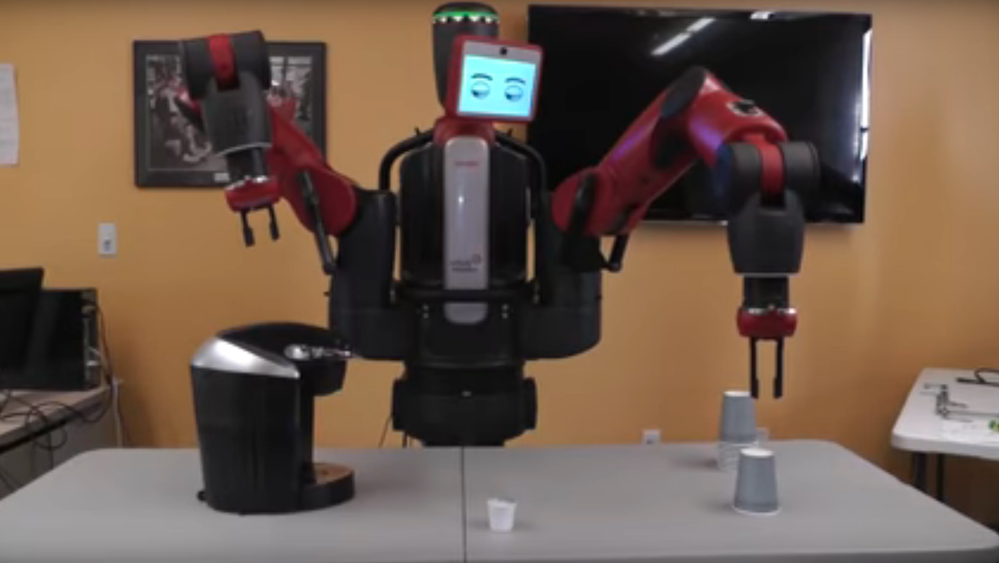

# Coffee Maker API




### Requirements

```
go get github.com/gin-gonic/gin
go get github.com/satori/go.uuid
go get -u github.com/Depado/ginprom
go get -u github.com/shenwei356/rush/
```

### Building and running

```
go build coffeeMachine.go 
./coffeeMachine
```


### Start making a cup of coffee in 5 minutes on OSX

```
curl -s -d '{"CupSize": 1, "CupBean": 2, "CupStrength": 3, "StartBrewTime": "'`date -v+5M -u +"%Y-%m-%dT%H:%M:%SZ"`'"}' localhost:8080/BrewCup | jq -C .
```

### Start making a cup of coffee in 5 minutes on Linux

```
curl -s -d '{"CupSize": 1, "CupBean": 2, "CupStrength": 3, "StartBrewTime": "'`date +"%Y-%m-%dT%H:%M:%SZ" --date="5 minutes"`'"}' localhost:8080/BrewCup | jq -C .
```

### Add 1000 cups of two different type to the queue (Which won't finish in really life or will they?)

```
time seq 500 | rush -j 10 'curl -s -d '\'{\"Cups\": \[{\"CupSize\": 1, \"CupBean\": 2, \"CupStrength\": 3000, \"StartBrewTime\": \""`date -v+5M -u +"%Y-%m-%dT%H:%M:%SZ"`"\"},{\"CupSize\": 3, \"CupBean\": 1, \"CupStrength\": 6, \"StartBrewTime\": \""`date -v+5M -u +"%Y-%m-%dT%H:%M:%SZ"`"\"}\]}\'' localhost:8080/QueueRequest| jq -C .'
```

### Check the queue status 
```
curl -s localhost:8080/QueueStatus
```

### Scrape Metrics

```
curl -s localhost:8080/metrics
```

